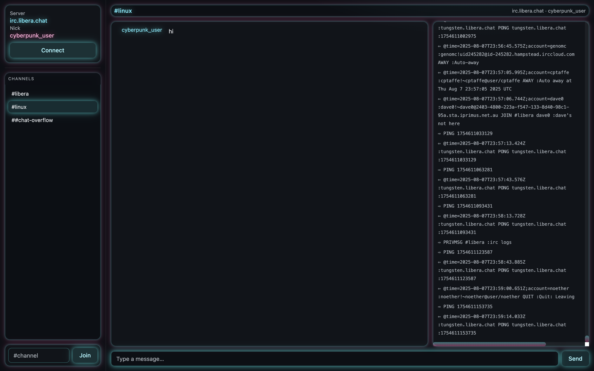

# Neon IRC Chat

A minimal, beautiful, cyberpunk terminal–inspired IRC client for macOS. Built with Electron, Vite, React, and Tailwind (shadcn-inspired UI). Neon glows, soft noise, gridlines, and crisp typography deliver a focused chat experience that still feels alive.

## Features
- Neon cyberpunk terminal aesthetic with tasteful glow
- Electron + Vite + React for fast, native-feel desktop UX
- Tailwind utility styling with shadcn-style primitives
- SASL (PLAIN/EXTERNAL) and NickServ authentication
- In-app Join box to add channels without reconnecting
- Verbose connection logging with raw line mirroring (redacted where needed)
- Sensible defaults for Libera.Chat with TLS

## Preview

<p align="center">
  
</p>

> If the image doesn’t load yet, pull latest or place your screenshot at `docs/screenshot.png` and commit.

## Install

Prerequisites: Node 18+ and npm.

```bash
npm install
```

## Run (development)

Runs Vite dev server and Electron with auto-reload:

```bash
npm run dev
```

If port 5173 is occupied, stop other dev servers first.

## Build & Run (production-like)

```bash
npm run build
npm run start
```

## Usage
- Click Connect to join an IRC network (defaults to `irc.libera.chat:6697`).
- Choose an auth method: None, NickServ, or SASL (PLAIN/EXTERNAL).
- Join channels via the sidebar Join box (e.g. `#linux`).
- Your messages are cyan, others magenta; notices purple; errors red.
- View the live Connection Log panel on the right (wide screens) for raw in/out lines, or open DevTools console.

## Configuration
- UI theme uses CSS variables and Tailwind; edit `src/styles/globals.css`.
- IPC and IRC wiring live in `electron/main.js` and `electron/preload.js`.
- Renderer app: `src/App.jsx` with small UI components under `src/components`.

## Security Notes
- Sensitive outbound lines (PASS/AUTHENTICATE/IDENTIFY) are redacted from logs.
- Prefer SASL where possible; EXTERNAL requires client certs.

## Tech Stack
- Electron (main/preload)
- React 18 + Vite 5
- Tailwind CSS 3 (shadcn-inspired primitives)
- irc-framework (solid IRC protocol handling)

## License
MIT — see `LICENSE` if added. Use at your own risk.
